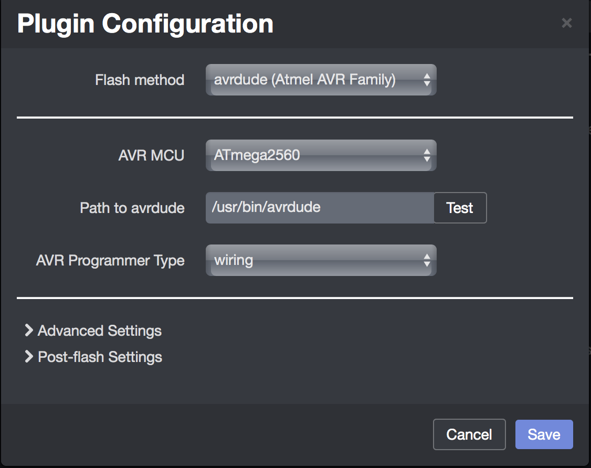
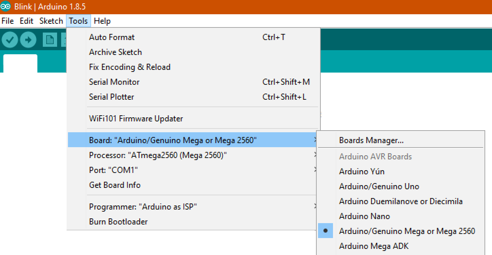

# How to Flash

There are two parts to flash:

* The **LCD resources**
* The **mainboard** (custom Marlin firmware)

**IMPORTANT**: Do not mix different versions. Both the LCD and the mainboard must have the exact same version.

## Part 1 - Flashing the LCD resources

**IMPORTANT**: When you flash **ADVi3++** LCD for the first time, you will not see the new screens until you flash the Mainboard part.

### LCD Step 1 - Prepare a microSD card

**IMPORTANT**: You **have to** use a microSD card with a maximum capacity of **8GiB**. If you use a microSD card with a greater capacity, the results are **unreliable** (sometimes it flashes, sometimes not, who knowns what may happend). This is a limitation of the LCD panel itself.

You have two possibilities to flash:

#### LCD Step 1 - Option 1 - Manual copy

* Download the LCD resources: [ADVi3pp-LCD-x.x.x.zip](https://github.com/andrivet/ADVi3pp-Marlin/releases)
* Unzip the file somewhere
* Manually copy all the files and folders from the uncompressed zip file to the root of a microSD card. The microSD card **must** be formatted with the following parameters: 
    * FAT32
    * 4096 bytes per cluster (i.e. 8 sectors).
* To format under Linux (and macOS with the `dosfstools` Homebrew package):

```
mkfs.fat -F 32 -n SD -s 8 -v /dev/disk2
```

**Note:** *Be sure to replace `/dev/disk2` with the correct value.*

* To format under Windows (Command Prompt):

```
format G: /FS:FAT32 /V:LCD /A:4096
```

**Note:** *Be sure to replace `G` with the correct volume letter.*

#### LCD Step 1 - Option 2 - SD image

* Download the microSD card image: [ADVi3pp-LCD-x.x.x.img.zip](https://github.com/andrivet/ADVi3pp-Marlin/releases)
* Unzip the `.img.zip` file and use either `dd` (Linux, macOS) or [Etcher](https://etcher.io) (Windows, Linux, macOS). For example with `dd`:

```
unzip ADVi3pp-LCD-1.0.0.img.zip
sudo dd if=ADVi3pp-LCD-1.0.0.img of=/dev/disk2 bs=64K
```

**Note:** *Be sure to replace `/dev/disk2` with the correct value.*

If you prefer graphical applications, [Etcher](https://etcher.io) is a great multi-platform tool.

### LCD Step 2 - Install the new version

- Disconnect the printer from power
- Remove the two screws located on the front and loosen the two M3 grub screws on top of the linear rod holders


- Remove the front panel carefully (don't break the flat cable)
- If you are lucky, you can insert the microSD card on the left of the panel (this is the case on the Monoprice clone)
- Otherwise, remove the four M3 screws and remove the cover
- Insert the microSD card in the slot


**Note**: You're LCD panel board may look slightly different as Wanhao uses different models depending on the phase of the moon.

- Turn on the printer; either by connecting it to power or by connecting the USB slot to the computer
- The screen will turn blue for a while, then every image will appear one by one
- After about 2 or 3 minutes, no more images will appear
- Turn off the printer and remove the microSD card
- Re-assemble the front panel. Do not forget the two M3 grub screws on top of the linear rod holders
- Turn the printer on. If you are flashing **ADVi3++** for the first time, the new screens will not appear until you flash the Mainboard part

### LCD Enclosures


Available on [Thingiverse "Wanhao Duplicator I3 Plus LCD enclosure" by bosbessenbasje](https://www.thingiverse.com/thing:2369322):

>  The standard enclosure puts the LCD in a 90 degrees angle towards the table and that makes it hard to read. This enclosure will put the LCD in 60 degrees angle which improves readability at the cost of a slightly large space on the table.

> Note that the new enclosure allows you to insert a **micro SD in the LCD to upgrade the LCD firmware** if you want to. You will probably need some pliers to do it though.

Another great enclosure is the following:


also available from [Thingiverse "LCD Holder with Micro SD card tray" from April1](https://www.thingiverse.com/thing:2882653).

I highly recommend these LCD enclosures. They simplify future flashing.

## Part 2 - Flashing the mainboard firmware

There are several ways to flash the mainboard firmware. The first step is to download the firmware from the **Releases** page on [GitHub](https://github.com/andrivet/ADVi3pp-Marlin/releases):

[ADVi3pp-Mainboard-x.x.x.hex](https://github.com/andrivet/ADVi3pp-Marlin/releases)

Then choose the option you are the most comfortable with.

**Note**: *It is not possible to flash the mainboard using the SD card slot of the printer.*

### Mainboard Option 1 - Flashing using Cura

**WARNING**: Some (recent) versions of Cura for Windows have a bug and it is not possible to flash with them (the flashing process gets stuck). Cura **3.3.x versions** are known to have this problem. [Version 3.2.1](https://ultimaker.com/en/products/ultimaker-cura-software/download-request/174) is working.

* if net yet done, download Cura. I recommend either:
    * [Cura for Wanhao](http://www.wanhao3dprinter.com/Down/ShowArticle.asp?ArticleID=56) if you directly connect the printer to your computer with a USB cable
    * [Ultimaker Cura 3](https://ultimaker.com/en/products/ultimaker-cura) if, for example, you are using OctoPrint to print
* Start **Cura**
* In the top menu, under **Settings** &#8594; **Printer**, select **Manage Printers**
* Select your printer or **Add** your printer if it is not already done
* Select **Upgrade Firmware** and then **Upload custom Firmware**
* Select the downloaded file `ADVi3pp-Mainboard-x.x.x.hex` and click on **Open**

### Mainboard Option 2 - Flashing using OctoPrint

You need `avrdude` and the **Firmware Updater** plugin.

To install `avrdude` on a Raspberry Pi:

* Connect to the Raspberry (for example through SSH) and enter the command:

```
sudo apt update; sudo apt install avrdude
```

To install the **Firmware Updater** plugin

* Open a navigator and connect to **OctoPrint**
* **Login** and click on the wrench icon in the toolbar
* Select **Plugin Manager** &#8594; **Get More...**
* In the **Search** box, enter **Updater**
* Click on **Install** in front of **Firmware Updater** 
* Restart **OctoPrint**

To flash the firmware:


* When **OctoPrint** is rebooted and the UI reloaded, click on the wrench icon in the toolbar
* Under **Plugins**, choose **Firmware Updater**
* Click on the wrench icon, and enter the following parameters:

  * **Flash method**: avrdude
  * **AVR MCU**: ATmega2560
  * **Path to advdude**: `/usr/bin/avrdude`
  * **AVR Programmer Type**: wiring
  


* Click **Save**
* Be sure your USB port appears after **Serial Port**
* After **... from file**, click on **Browse** and select the firmware you have downloaded such as `ADVi3pp-Mainboard-x.x.x.hex`
* Click on **Flash from File**
* The flashing process may take around 30 seconds
* When it is finished, a message appears saying **Flashing successful**. Click on **Save**
* Reconnect the printer

### Mainboard Option 3 - Flashing using Arduino IDE

**Note**: By default, the sources gives a RELEASE build **without** BLTouch support. To build a release with BLTouch support, please follow the instructions under [Build a BLTouch release with Arduino IDE](05-Building.md#build-a-bltouch-release-with-arduino-ide)

* Connect your printer to your PC using the USB cable
* Download [Arduino IDE](https://www.arduino.cc/en/Main/Software)
* Open Arduino IDE
* Under **Tools** &#8594; **Board**, select **Arduino/Genuino Mega or Mega 2560**
* Under **Tools** &#8594; **Processor**, select **ATMega2560 (Mega 2560)**
* Under **Tools** &#8594; **Port**, select the port your printer uses



* Under **File** &#8594; **Open**, select `Marlin.ino` located in the **Marlin** folder
* Click on the **Upload** button, on press `Ctrl` + `U`

The firmware is compiled and uploaded. When the uploading is finished, the printer reboots.

### Mainboard Option 4 - Flashing using `avrdude`

All the previous options are using [`avrdude`](http://www.nongnu.org/avrdude/) underneath. `avrdude` is an utility to download/upload/manipulate the ROM and EEPROM contents of AVR microcontrollers. It can be downloaded from your favorite repository or from [Savannah Non-GNU web site](http://download.savannah.gnu.org/releases/avrdude/).

* For Debian/Ubuntu:

```
sudo apt install avrdude
```

* For macOS (Homebrew):

```
brew install avrdude
```

* For Windows, download `avrdude-6.3-mingw32.zip` or a higher version.

The command line is the following:

```
avrdude -v -p m2560 -c wiring -P <printer_port> -U flash:w:<firmware.hex>:i -D
```

Replace `<printer_port>` and `<firmware.hex>` with the right values. For example (Windows):

```
avrdude -v -p m2560 -c wiring -P COM3 -U flash:w:ADVi3pp-Mainboard-2.0.0.hex:i -D
```

or (Linux):

```
avrdude -v -p m2560 -c wiring -P /dev/ttyUSB0 -U flash:w:ADVi3pp-Mainboard-2.0.0.hex:i -D
```

# Troubleshooting

### The LCD part does not flash properly

Be sure to use a 8 GiB microSD and not with a higher capacity. The LCD panel is not able to read reliably high capacity cards. 

### The LCD panel behave strangely: When you press somewhere, it activates an element at a different place

You probably enter calibration mode. There are two ways to solve this:

* Press the screen very rapidly 20 times
* Create a `CONFIG.TXT` file in the root of a microSD card with the following content:

```
TP_CORRECT
```

### After reassembly, the LCD displays nothing

Be sure the flat cable between the LCD and the mainboard is properly inserted in its connectors. This cable and the connectors are very fragile. 

The cable is a standard flat flexible (FFC) jumper cable, 1.0 mm pitch, 10 way. You can buy some from a local reseller. For example from [RS-Online, manufactured by Wurth Elektronik](https://uk.rs-online.com/web/p/ffc-fpc-jumper-cables/7635697/).

### When trying to flash the motherboard, the computer does not see the printer

The most common reasons are the following:

* **Wrong baudrate**. Your computer may have selected a wrong baudrate such as 9600. The default baudrate for this printer is 115200
* **Missing USB driver**. Most of the time, the operating system installs the right USB driver for the printer. But sometimes, the installation fails. The i3 Plus printer uses a cheap USB-to-Serial bridge WCH CH340G. The driver can be downloaded from the [web site of the manufacturer (in Chinese)](http://www.wch.cn/download/CH340DS1_PDF.html). The file to download is [CH341SER.EXE](http://www.wch.cn/downloads/file/65.html) for Windows and [CH341SER_MAC.ZIP](http://www.wch.cn/downloads/CH341SER_MAC_ZIP.html) for macOS.
* **Bad USB cable**. Try to use another, shorter, USB cable


