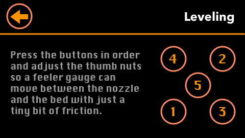
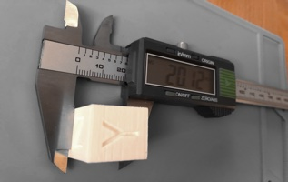
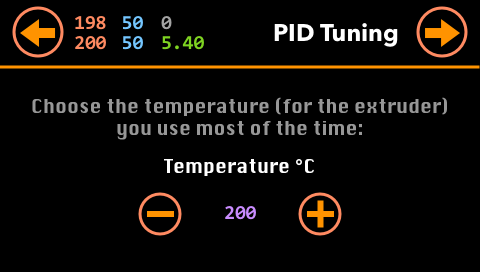
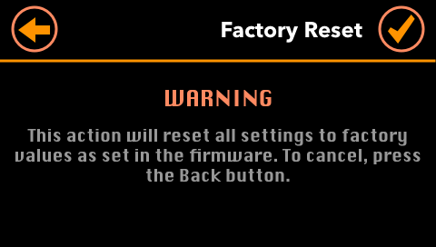
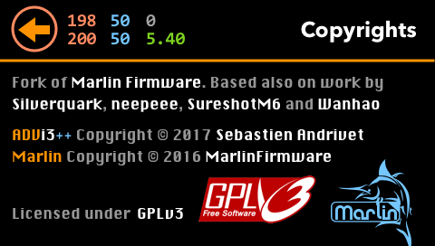

# LCD Touch Screen

## Main panel

* **Temperatures**: Displays the current temperature of the extruder (red) and of the bed (blue). Displays also the current speed of the extruder's fan (gray) and the z-height in mm (green). Tap on this area to show a graph of temperatures.
* **Version**: Displays the version number of **ADVi3++**. Taps on this area to show an About panel with information about the release installed.
* **Controls**: Taps on this button to display the **Controls** panel with tools such as Load and Unload Filament, Move, etc.
* **Print**: Taps on this button to display the **Print** panel (if your are printing) or the Temperature graph (if you are not).
* **Tuning**: Taps on this button to display the **Tuning** panel with tools to help you adjust some parameters of your printer.
* **Settings**: Taps on this button to display the **Settings** panel. In this panel, you can view and modify several parameters of the printer.
* **Info**: Taps on this button to display the **Information** panel with access to information such as **Statistics**, **Versions** and **Copyrights**.

## Controls

This panel gives you access to tools to control your printer.

* **Load & Unload**: Tools to Load or Unload Filament (see below).
* **Preheat**: Set of preheat settings (both Hot-end and Bed - see below).
* **Cooldown**: Disable both heated bed and Hot-end.
* **Move**: Tools to move the head of the printer, and to extrude or unextrude filament (see below).
* **Disable drive**: Disables all motors so you are able to move the head manually.

### Load & Unload

Select the extruder's target temperature you want to use (with the plus and minus buttons) and press either the **Load** or **Unload** button. 

**Tip**: *Keep the button pressed to quickly increment or decrement the temperature.*

When the target temperature is almost reached, the extruder motor starts  extruding or extruding filament. When the filament comes out of, press the **Back** button.

### Preheat

You have the choice of three presets (both bed and hot-end temperatures). You can adjust each value by pressing the plus and minus buttons. To start heating bed and hot-end, press one of the checkmark button. To stop heating, press the cooldown button on the top right corner.

**Tip**: *Keep the button pressed to quickly increment or decrement a temperature.*

**Important**: *If you press the __Back__ button, the printer continues to heat the bed and the hot-end. Press __Cooldown__ on this screen or on the __Tools__ screen to stop heating.*

### Move

* You can move the head (X & Z) and the bed (Y) by pressing the buttons with arrows.

**Tip**: *Keep the button pressed to quickly move the head or the bed.*

* Press the `E +` button to extrude some filament; press the `E -` button to un-extrude.

**Important**: *The printer will extrude or un-extrude only if the temperature of the hot-end has reached a minimal value.*

* Press a button with a house icon to home the head (X & Z) or the bed (Y). Press the button with the star (*) to return both bed and hot-end to their home positions.
* Press the button with the motor icon (top-right corner) to disable all motors so they are free to move by hand.

## Print

The exact screen displayed is dependent of the context (in this order):

* If you are printing from the SD card or through USB (i.e. from Cura, OctoPrint, ...), the **Print** screen is displayed (see above).
* If you are not printing and a SD card is inserted in the SD slot (and readable), the **SD Card** screen is displayed (see below).
* Otherwise, the **Temperature Graph** is displayed.

### SD or USB Print

The **Print** screen is displayed only when a print is running.

* It displays a graph of the temperatures (bed in blue, hot-end in red).
* **Stop**: Press the **Stop** button to stop the current printing. It also goes back to the previous screen. In case of a **USB Print**, it **disconnect the printer** as it is currently the only universal way to stop such print.
* **Pause**: Press the **Pause** button to temporary stop the printing.
* **Resume**: Press the **Resume** button to resume a paused printing.
* **Print Settings**: Press on the gear button to display and modify the **Print Settings** like the temperature, the fan speed, etc.
* **Back**: If you press the **Back** button, the printing continues and it goes back to the previous screen.

### SD Card

The **SD Card** screen is displayed only when a SD card is inserted in the SD slot of the printer and is readable. It displays all the files in the root of the SD card.

* If there are more than 5 files, use the two arrow button to display the files page per page.
* To print a file, press its name. The **Print** is displayed and the printing starts.

### Temperature

* The extruder graph and temperature are in **red**
* The bed graph and temperature and in **blue**
* The fan speed in in **gray**
* The z-axis position is in **green**

### Print Settings

In this screen, you can adjust print parameters during a print:

* **Printing Speed**: The motor speed multiplier. Speed of motors is multiplied by this rate.
* **Fan Speed**: The fan speed multiplier. Speed of the fan (in the front) is multiplied by this rate.
* **Hot-end**: Temperature of the hot-end.
* **Bed**: Temperature of the bed.

## Tuning

This panel gives you access to tools to help you adjust some parameters of your printer.

**Important**: Some parameters are directly derived from the mechanical parts of the printer. Unless you change these parts (like the stepper motors), there is no need to change them.

* **Manual Level**: Tool to help you level your bed manually.
* **Extruder**: Tool to help you adjust the number of steps per millimeter for the extruder motor.
* **XYZ motors**: Tool to help you adjust the number of steps per millimeter for X and Y motors.
* **PID tuning**: Tool to help you adjust the PID parameters ([proportional-integral-derivative control algorithm](http://reprap.org/wiki/PID_Tuning)).
* **Sensor**: Tools related to your sensor (if you have one), such as measuring Z-height and automatic bed leveling.

### Manual Level

This tool helps you level your bed manually.

* First, the head and bed return to their home position.
* Then, press one of the button with a number to go to each position:

* Adjust each thumb nut so a feeler gauge (0.1 mm) can move between the nozzle and the bed with just a tiny bit of friction:

* If you do not have a feeler gauge, you can also use a sheet of paper but it is less accurate.
* Press the 5th button to check that your leveling is good. Press any of the other button to level again the corresponding corner.
* Once you are satisfied with the leveling, press the **Back** button.

**Tip**: *A feeler gauge are cheap and you can buy one for a few dollars on Amazon, Banggood, etc. For example (randomly chosen items)*:

[amazon.com](https://www.amazon.com/Uxcell-Measure-Feeler-Blades-0-02mm/dp/B012FD5JLO/ref=pd_lpo_vtph_263_lp_t_2?_encoding=UTF8&psc=1&refRID=2Q4R5GBHAVB7SKVE2E5T)

[banggood.com](https://www.banggood.com/17pcs-Blade-Feeler-Gauge-Thickness-Gap-Metric-Measure-Tool-Set-0_02mm-to-1mm-p-1093020.html?rmmds=search&cur_warehouse=CN)

### Extruder

This tool helps you adjust adjust the number of steps per millimeter for the extruder motor. There is no need to do this more than once, except if you change some mechanical parts.

**Important**: *This parameter (number of steps per millimeter) is directly derived from the mechanical parts of the printer (the stepper motor, the gear, ...) Unless you change these parts (like the gear), there is no need to change this parameter. Its default value is `400`.*

* Measures 120 mm of filament above the extruder and set, with a pen, a mark on the filament:

* Select the extruder's target temperature you want to use (with the plus and minus buttons) and press the arrow button (top-right corner). 

**Tip**: *Keep the button pressed to quickly increment or decrement the temperature.*

* The printer starts heating the hot-end and when the target temperature is reached, it extrudes 100 mm of filament.

* Once the extrusion is finished (it takes around a minute), measures the filament remaining between the extruder and your mark:

* Enter the value in mm:

**Tip**: *Keep the button pressed to quickly increment or decrement the value.*

* The computed value (E) is displayed and you can adjust it manually if you want:

* Press the **Back** button the restart the process, or on the **Checkmark** button to save the settings. They are saved in the EEPROM memory of the motherboard.

### XYZ motors

This tool helps you to adjust the number of steps per millimeter for the X, Y and Z motors. There is no need to do this more than once, except if you change some mechanical parts.

**Important**: *These parameters (number of steps per millimeter) are directly derived from the mechanical parts of the printer (the stepper motor, ...) Unless you change these parts (like the motors), there is no need to change these parameters. The default values are `80`, `80`, and `400`.*

* Print a cube 20x20x20 mm  and enter it actual dimensions (make more than one measure for each side and take the average):

* The computed values (X, Y and Z) are displayed and you can adjust them manually if you want:

* Press the **Back** button the restart the process, or on the **Checkmark** button to save the settings. They are saved in the EEPROM memory of the motherboard.

**Tips**: *There are several calibration cubes on [Thingiverse](https://www.thingiverse.com). For example:*

[XYZ 20mm Calibration Cube by iDig3Dprinting](https://www.thingiverse.com/thing:1278865)

*Measure X*:

*Measure Y*:

*Measure Z*:

### PID tuning

> PID tuning refers to the parameters adjustment of a proportional-integral-derivative control algorithm used in most repraps for hot ends and heated beds.

[RepRap web site](http://reprap.org/wiki/PID_Tuning)

* Select the extruder's target temperature you want to use (with the plus and minus buttons) and press the arrow button (top-right corner). 

**Tip**: *Keep the button pressed to quickly increment or decrement the temperature.*

* The PID tuning process starts. The printer increase and decrease the temperature of the hot-end around the target value:

* When the PID tuning is finished (after some minutes), the new PID values are displayed:

* Press the **Back** button the restart the process, or on the **Checkmark** button to save the settings. They are saved in the EEPROM memory of the motherboard.

### Sensor

This panel gives you access to tools to control your sensor.

**Note**: If you have flashed a version without sensor support, it will display instead a **No Sensor** panel.

* **Leveling**: This starts the automatic leveling process. It measures 9 points of the bed and takes some minutes. Once the measuring is finished, it displays the result in a grid.
* Press the checkmark to accept these measures.

**IMPORTANT**: For an accurate leveling, you have to measure the **Z-height** first (see bellow)

* **Self-test**: Start the self-test of the probe. To stop the test, press **Reset**
* **Reset**: Reset the sensor in case of an error (when the LED of the sensor is flashing)
* **Deploy**: Deploy the push-pin
* **Stow**: Slow the push-pin
* **Z-height**: The sensor has no way to know the distance between itself and the nozzle. For X and Y offsets, it depends of the sensor's support and it does not have to be precise. But for the Z axis, it has to be very precise. This tool helps you measure the Z-height:
  
  * Taps on **Z-height**.
  * The head with move to its home position (at the center of the bed)

  
  
  * Adjust the bed's four thumb nuts so a feeler gauge can move between the nozzle and the bed with just a tiny bit of friction. Contrary to the Manual bed leveling, you just have to adjust this location.
  * Press the **Continue** button and the probe will move at the center of the bed and measure the Z-height. Once it is done, the result is displayed:

  
  
  * You can adjust the Z offset (most of the time, there is no need to adjust the measured value)
  * Tap on the checkmark to save this setting.

## Settings

* **Motors**: Displays several settings related to the stepper motors (see bellow).
* **PID**: Displays the current PID settings.
* **Firmware**: Change parameters controlled the firmware such as the thermal protection and the baud rate.
* **Sensor**: Displays and let you adjust sensor's settings.
* **LCD**: Change LCD parameters such as the dimming and the buzzer.
* **Reset** (in the top-right corner): Resets all the parameters stored in EEPROM to their factory values.

* Before resetting all the settings to their default, you have to confirm it by pressing the **Checkmark** button.
* If you do not want to reset the settings, press the **Back** button.
* Once confirmed, all settings are reset to their default and saved in the EEPROM memory of the motherboard.

### Motors

* **Steps**: Displays the step settings of the motors.
* **Feedrate**: Displays the feedrate (speed) settings of the motors.
* **Acceleration**: Displays the acceleration settings of the motors.
* **Jerk**: Displays the jerk settings of the motors.

### Steps

This screen display the step settings of the motors.

* To adjust them manually, press the minus or plus buttons.

**Tip**: *Keep the button pressed to quickly increment or decrement the temperature.*

* To save them, press the **Checkmark** button. The settings are saved in the EEPROM memory of the motherboard.
* The cancel any changes, press the **Back** button. It goes back to the previous screen.

### Feedrate

This screen display the feedrate (speed) settings of the motors.

* To adjust them manually, press the minus or plus buttons.

**Tip**: *Keep the button pressed to quickly increment or decrement the temperature.*

* To save them, press the **Checkmark** button. The settings are saved in the EEPROM memory of the motherboard.
* The cancel any changes, press the **Back** button. It goes back to the previous screen.

### Acceleration

This screen display the acceleration settings of the motors.

* To adjust them manually, press the minus or plus buttons.

**Tip**: *Keep the button pressed to quickly increment or decrement the temperature.*

* To save them, press the **Checkmark** button. The settings are saved in the EEPROM memory of the motherboard.
* The cancel any changes, press the **Back** button. It goes back to the previous screen.

### Jerk

This screen display the jerk settings of the motors. The (maximum) jerks are the instantaneous change of speed that can be made. In other words, it is the (maximum( speed that the printer will immediately jump to before taking acceleration into account.

* To adjust them manually, press the minus or plus buttons.

**Tip**: *Keep the button pressed to quickly increment or decrement the temperature.*

* To save them, press the **Checkmark** button. The settings are saved in the EEPROM memory of the motherboard.
* The cancel any changes, press the **Back** button. It goes back to the previous screen.
 
### PID

> PID tuning refers to the parameters adjustment of a proportional-integral-derivative control algorithm used in most repraps for hot ends and heated beds.

[RepRap web site](http://reprap.org/wiki/PID_Tuning)

This screen display the jerk settings of the motors. The (maximum) jerks are the instantaneous change of speed that can be made. In other words, it is the (maximum( speed that the printer will immediately jump to before taking acceleration into account.

* To adjust the PID settings manually, press the minus or plus buttons.

**Tip**: *Keep the button pressed to quickly increment or decrement the temperature.*

* To save them, press the **Checkmark** button. The settings are saved in the EEPROM memory of the motherboard.
* The cancel any changes, press the **Back** button. It goes back to the previous screen.

### Firmware

* **Thermal protection**: Can can disable or enable **Thermal protection**. Thermal protection is a feature of Marlin firmware that can detect anomalies such as a broken thermistor. In some cases, it can save your printer and even your house from fire. However, if you get several **Thermal Runaway Errors** and you are sure your printer is OK, you can disable here the protection. **AT YOUR OWN RISK**.
* **USB baudrate**: By default, the firmware uses `115200` bps to communicate with your computer. You can adjust the baud rate here. I have had good results with `250000` bps and OctoPrint.

### Sensor

  * You can adjust the **Z offset** here. This offset is the difference between the nozzle and the trigger point of the sensor in mmm.
  * Tap on the **Checkmark** button to save this setting.

### LCD

* **Screen dimming**: By default, the LCD displays lower its brightness after one minute. Here, you can disable or enable this dimming.
* **Brightness**: Adjust the brightness of the LCD display.
* **Beep when waiting action**: Enable or disable the buzzer when the printer is waiting for an action. It is in particular the case when loading or unloading filament, and with Advanced Pause (M600)
* **Beep on press**: Enable or disable the buzzer when you tap on the LCD panel

## Info

* Displays information about the past prints, the versions of the different components and the cppyrights.

### Statistics

This screen display various statistics:

* **Total prints**: The number of prints send to the printer.
* **Completed prints**: The number of prints completed.
* **Total print time**: The total time spend on printing.
* **Longest print time**: The longest print.
* **Total filament extruded**: The total number of meters of filament extruded.

### Versions

This screen display the version of several software components:

* **ADVi3++ LCD**: The version of the LCD part of **ADVi3++**.
* **ADVi3++ Motherboard**: The version of the Motherboard part of **ADVi3++**.
* **LCD firmware**: The version of the (internal) LCD touch screen display.
* **Marlin**: The version of the [Marlin](http://marlinfw.org) sources used by **ADVi3++**.

### Copyrights

* Copyrights and licences. Both **Marlin** and **ADVi3++** are released under [GPLv3 license](https://www.gnu.org/licenses/gpl-3.0.en.html).

### Sponsors

You can sponsor **ADVi3++** on [Patreon](http://www.patreon.com/andrivet). As part of the $16 reward and if you agree, your name (or pseudo) will be mentioned on this screen, in the documentation of ADVi3++, its web site, in the binaries and your name will even be displayed when the firmware boots (on the COM port).

## Thermal Runaway Error

ADVi3++ (thanks to Marlin Firmware) has an important safety feature enabled by default and that is not present in the stock firmware: **thermal protection**. 

If your thermistor falls for a reason, if will give a wrong value to the firmware (around 0) and if the bed or the hotend are heating, they will continue to heat and heat (believing that the temperature is not increasing) until... it eventually **burns**. This is why Marlin has introduce a safety feature: if some abnormal occurs, the firmware will stop heating, display this message and shutdown.

When this screen is displayed, it indicates in blue the anomaly detected:

* **Maximum temperature exceeded**: When the temperature of the hotend is higher than the maximum allowed (currently 275°C)
* **Maximum bed temperature exceeded**: When the temperature of the bed is higher than the maximum allowed (currently 150°C)
* **Minimum temperature exceeded**: When the temperature of the hotend is lower than the minimum allowed (currently 5°C)
* **Minimum bed temperature exceeded**: When the temperature of the bed is lower than the minimum allowed (currently 5°C)
* **Heating failed**: When the hotend or the bed is too slow to heat
* **The temperature has deviated too much**: After reaching the target temperature, the temperature is not stable and has deviated too much

In case of an error, I highly recommend that you check your printer, especially the thermistors. They can become loose with the movement of the bed and of the head and give wrong measures. Your thermistors can also fail.

If you are absolutely sure that nothing is wrong and you still have errors, you have the possibility to disable Thermal Protection in **Settings** / **Firmware**. **But this is AT YOUR OWN RISK**.

## EEPROM Settings Reset Warning

When you upgrade **ADVi3++**, this message may appears one time on boot. This is because the settings of the new version are not compatible with those of the old one. So the settings are reset and you have to either enter settings manually or redo the tuning.  

## Version Warning

When you upgrade **ADVi3++**, this message may appears if you have a version of the LCD part that is not compatible with the mainboard part. You have to use compatible versions (i.e. the same version for both).

## No Sensor

There are currently two binaries for the Mainboard part of **ADVi3++**: one for the stock i3 Plus printer, and one for the printer with BLTouch. If you press a sensor function with a mainboard for the stock printer, this message is displayed.

