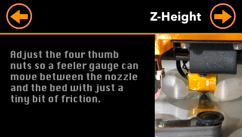
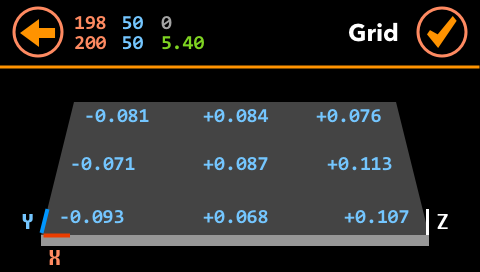

# BLTouch Sensor Support

## Introduction

**BLTouch** is an automatic bed leveling sensor for 3D printers created by [Paris Kyung-Yeon Lee (ANTCLABS)](https://www.antclabs.com/about).


**BLTouch** does not uses either optical, nor proximity (inductive / capacitive) sensor. It is controlled by [hall effect](https://en.wikipedia.org/wiki/Hall_effect), providing high precision and it works with any kind of bed material.

There two kinds of **BLTouch** sensors:

* BLTouch **Classic**: The original BLTouch
* BLTouch **Smart**: The latest version of BLTouch


Technically, these two sensors are very different:

* Circuit boards are completely different
* The suggested clearance between the pin and the bottom of the hot end is 3 mm for BLTouch Smart, 2 mm for BLTouch Classic
* There is a 0.5 mm difference in height
* BLTouch Smart is also slightly larger
* The pulse width for detection has decreased from 10 ms to 5 ms (i.e. BLTouch Smart is more accurate)
* BLTouch Smart added a blue LED for indicating servo signal and Z-probe testing

As a user, these two sensors are very similar and are used the same way.

Since version 3.0, **ADVi3++** supports **BLTouch** sensors.

## BLTouch Clones

These clones are poor imitations of BLTouch and are **unreliable** (by their design and because they use cheap components).

They are also violation of the Intellectual Property of [Paris Kyung-Yeon Lee (ANTCLABS)](https://www.antclabs.com/store). Some are even labeled "BLTouch, inspired by ANTCLABS".

Be sure to buy your BLTouch from an approved distributor or directly from ANTCLABS. For example:

* [Official store of ANTCLABS on ebay](https://www.ebay.com/itm/BLTouch-Auto-Bed-Leveling-Touch-Sensor-for-3D-Printers/201937461773)
* [Amazon](https://www.amazon.com/BLTouch-Leveling-Sensor-Premium-Printer/dp/B01FFV2TOS/ref=sr_1_1?m=A3O53RCZ1OROMM&s=merchant-items&ie=UTF8&qid=1483465267&sr=1-1#feature-bullets-btf)

**ADVi3++ does not support and will not support clones.**


## Installing BLTouch

### Step 1 - Print a support

A have made the following support:


[BLTouch Support for Wanhao i3 Plus and ADVi3++](https://www.thingiverse.com/thing:2847014). If you want to modify this support, the [original design is on Thinkercad](https://www.tinkercad.com/things/92jGN1jgv0f-bltouch-support-for-wanhao-i3-plus).

Alternatively, I have made another support: [Adjustable BLTouch Support](https://www.tinkercad.com/things/b0OuJbmr1rV-adjustable-bltouch-support)


It uses 4 M3 screws and 4 M3 nuts:


### Step 2 - Install the support and BLTouch

The support and BLTouch are placed in the front of the printer (BLTouch on the left):


Then you must ensure that the distance between the BLTouch and the bottom of the nozzle are within a range of **8 +/- 0.5 mm**:


**This distance is extremely important.** In order to help you, you can print this gauge:


[BLTouch Home & Auto Levelling Height Gauge](https://www.thingiverse.com/thing:1538742). This gauge has an height of 8.3 mm (i.e. is in the range of 8 +/- 0.5 mmm). To use it:

* Move the head so that it touches the bed (like if you were doing a manual bed leveling)
* Place the gauge on the bed
* Adjust the height of the BLTouch sensor. For that, you can use the springs delivered with the BLTouch


### Step 3 - Soldering headers

**ADVi3++** uses the EXT and the Z-probe connectors on the mainboard:

 


However, these connectors are naked and you have to **solder** heads or connectors:

* For the **Z-probe** connector, I have used a standard [JST XHP connector](https://www.pololu.com/file/0J372/JST_eXH.pdf)

* For the **EXT** connector, I have used a standard Dupont male connector head. You can find many kits (male and female) either in your local store or in [Internet shops](https://www.banggood.com/320Pcs-Dupont-Connector-Housing-Male-Crimp-Pins-Female-Terminal-Pitch-Jumper-Pin-Header-Kit-p-1091928.html?utm_source=google&utm_medium=cpc_elc&utm_campaign=ds-cpa1-earphone-rm-170823&utm_content=Bay&gclid=CjwKCAjwi6TYBRAYEiwAOeH7GbTr3wix7XLpoQRYo36d-ctoJHJV4gw6CJI9Hrk57CfnfzvqwtnkWhoCWf8QAvD_BwE&cur_warehouse=CN)

Do not try to fix wires with some glue or something similar. It will not work. You have to **solder**. And yes, it is recommended to remove completely the mainboard from the case to solder heads. It is not that complicated. Put labels on ribbon cables to plug then back properly.

You will obtain something like that:


### Step 4 - Wiring

The next step is to wire the BLTouch sensor. You will need a cable of approximately 1.35 m with 5 wires. I have have used [a ribbon "rainbow" cable](https://www.banggood.com/5M-1_27mm-20P-Jumper-Cable-DuPont-Wire-Rainbow-Flat-Wire-Support-Wire-Soldered-p-959792.html?rmmds=detail-top-buytogether-auto__5&cur_warehouse=CN). 

The wiring is the following:


| BLTouch wire | Connector | Pin # | Atmel | Description |
|--------------|-----------|-------|-------|-------------|
| White        | Z-Probe   | 2     | PA3   | Z-endstop   |
| Black        | Z-Probe   | 3     | GND   | Ground      |
| Orange       | EXT       | 1     | PG1   | Servo 0     |
| Red          | EXT       | 10    | VCC   | +5V         |
| Brown        | EXT       | 9     | GND   | Ground      |


Notes:

- There is no need to change the jumper near Z-probe since the related pin (pin #1) is not used.
- **Do not disconnect or remove your Z-min endstop switch**. It is still used for homing and for z-height measures (measuring the distance between the node and the trigger point of the sensor) 

### Part 5 - Flashing the Mainboard

You can now flash the Mainboard part as described in [How to Flash](How-to-Flash.md). Be sure to flash the part with BLTouch support.

### Part 6 - Testing

Power-on your printer and go into the **Tuning / Sensor** menu:


Hit **Self-test**. The probe will deploy and stow alternatively until you hit **Reset**. If this is not the case, review your wiring.

### Z endstop (min)


**DO NOT REMOVE** the existing Z enstop. It is used to measure the z-height (see below). I get some feedbacks suggesting this endstop is not necessary, or may even complicate things. For more the moment (i.e. for version 3.0.0), it is required.

## Using BLTouch

### Measuring Z-height

**Note**: You only have to do this from time to time especially if you move or disassemble parts such as the extruder.

In the current version (3.0.0), **ADVi3++** uses the Z min endstop in order to measure precisely the distance between the BLTouch (more precisely its triggering point) and the tip of the nozzle. You normnaly 

* Press **Z-height**
* The head will home and then go in the middle of the bed



* Adjust the thumb nuts so a feeler gauge (or a piece of paper) can move between the bed and the nozzle with just a tiny bit of friction. It is similar to manual bed leveling except you do this only for one point: the middle of the bed
* Hit the circled arrow to continue the process
* The firmware will measure the z-height.
* Once it is done, the result is displayed. You can adjust it, discard it or accept it:


### Automatic Bed leveling


You press **Leveling** to start the automatic bed leveling. Once it is done, the result is displayed in a grid:



When you press the checkmark, the computed mesh is saved into memory and into EEPROM.

## G-Codes

The following G-Codes are involved in automatic bed leveling:

| G-Code | Name | Description |
|--------|------|-------|
| `G28`  | Auto Home | Auto-home one or more axes. It also **disabled** bed leveling compensation. To reenable it, use `M420 S1`. |
| `G29`  | Automatic Bed Leveling | ABL probes the bed at 3 or more points and enables bed leveling compensation. It is required to auto home (`G28`) before. |
| `M420` | Bed Leveling State | Get and/or set the enabled state of bed leveling compensation. For example, `M420 S1` enables it. |

## Starting G-Code

Here is an example of starting G-Code:

```
G21                                             ; Set metric values
G90                                             ; Set absolute positioning
M82                                             ; Set extruder to absolute mode
G28 X0 Y0                                       ; Move X/Y to min endstops
G28 Z0                                          ; Move Z to min endstops
G1 Z20                                          ; Raise the head
G29                                             ; Auto-leveling
G1 X0 Y0 F3000                                  ; Go to home (without homing: it would disable compensation)
M190 S{material_bed_temperature_layer_0}        ; Wait for bed temperature to reach target
M109 S{material_print_temperature_layer_0} T0   ; Set extruder temperature and wait
G92 E0                                          ; Zero the extruded length
M300                                            ; Play tone
G1 F140 E30                                     ; extrude 30mm
G92 E0                                          ; zero the extruded length
```

**IMPORTANT**: If your code includes a `G28` after `G29`, this will disable z-height compensation. So you have to re-enabled it with:

```
M420 S1
```


