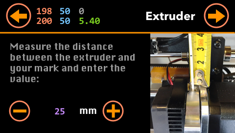
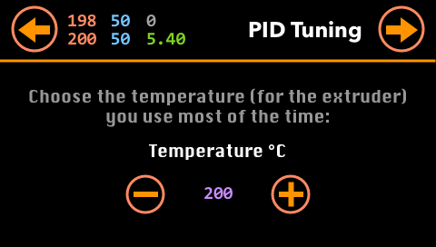
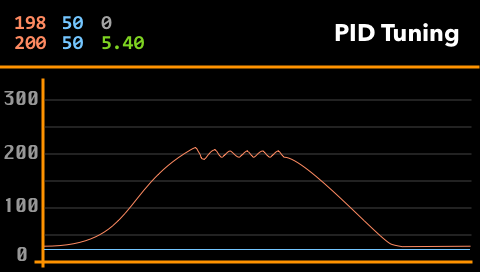
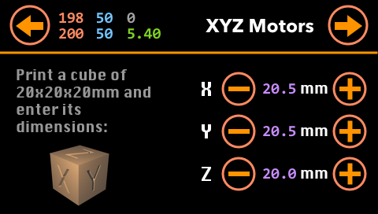
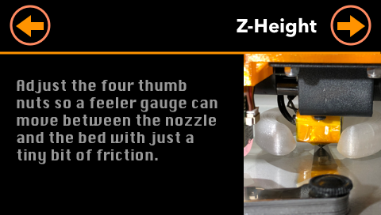
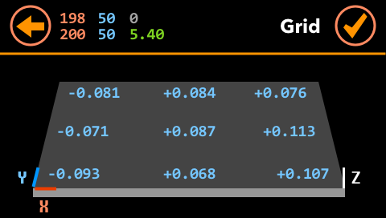
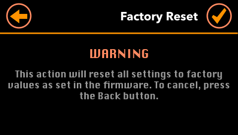
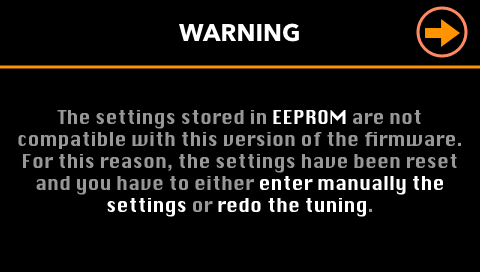

# Tuning

**ADVi3** includes tools to help you tune some aspects of your printer.

### Extruder Tuning

In general, you only have to do this **once** because this parameter does not change with time. It is related to the mechanics of your printer. If you change the gear of your extruder, you have to perform this tuning.

The maths are the following:

#### E axis

- The motors moves `1.8`&deg; per steps
- So a revolution has `360 / 1.8  = 200` steps
- The driver gives `16` micro-steps
- Let's assume the gear has a diameter of `10.95` mm
- So we have: `(200 * 16) / (10.95 *`&pi;`) = 93` steps / mm.

### PID Tuning

In general, you only have to do this **once** except if you change radically your extruding temperature or if your environmental conditions change, such as humidity, or if you change the insulation on the heater block, such as switching to a silicone sock.

### XYZ motors Tuning

In general, you do not have to do this because these parameters do not change with time. They are related to the mechanics of your printer. You have to redo this if you change the stepper motors.

The maths are the following:

#### X and Y axis

- The motors moves `1.8`&deg; per steps
- So a revolution has `360 / 1.8  = 200` steps
- The driver gives `16` micro-steps
- On X and Y axis, the toothed pulleys have `20` teeths
- The belts have a `2` mm tooth pitch
- So we have: `(200 * 16) / (20 x 2) = 80` steps / mm

#### Z axis

- The motors moves `1.8`&deg; per steps
- The lead screw is `8` mm per revolution
- So we have: `(200 * 16) / 8 = 400` steps / mm

## Manual leveling

You only have to do this if you do not have a sensor (such as BLTouch).

You have to do this frequently (almost before each print) and it is sometimes difficult to level all the points if your bed or other parts, such as linear rods, are bent.

## Sensor Z-height

You only have to do this if you have a sensor (such as BLTouch).

You only have to do this from time to time especially if you move or disassemble parts such as the extruder.

## Sensor Bed Leveling

You only have to do this if you have a sensor, such as the BLTouch. You can also do this, without displaying the grid, using the `G29` command either from a G-code start script or manual command.

## Reset Settings

If you reset settings, you will have to either perform the tunings again or reenter each of the settings.

## Flashing of new firmware version

If you flash a new firmware (especially a major version number), you may loose your settings and you have to either perform again the tunings or reenter the different settings.

